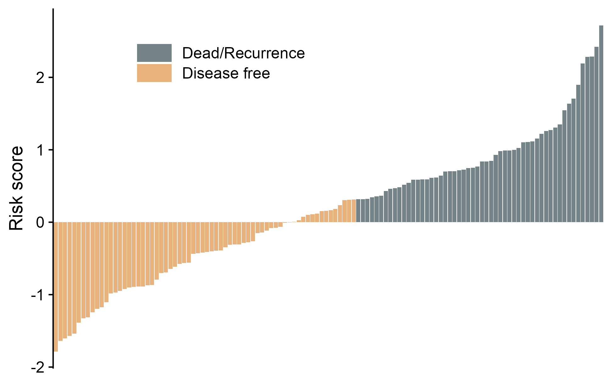

# gfplot

<!-- badges: start -->
[](https://github.com/gflab/gfplot/actions/workflows/R-CMD-check.yaml)
[](https://gflab.github.io/gfplot/)
[](https://github.com/gflab/gfplot/blob/master/LICENSE)
<!-- badges: end -->

Publication-ready figures for cancer bioinformatics, in the style the lab
submits with. Kaplan-Meier curves with hazard ratios, ROC and time-dependent
ROC curves, risk-score distributions, dimensionality-reduction projections,
boxplots and correlation plots, lasso coefficient paths, enrichment plots, and
immune-infiltration radar charts.

Every function returns a `ggplot` object, so figures stay editable with the
usual `ggplot2` grammar.

```r
library(gfplot)

p <- plot_KMCurve(clin, labels)
gfplot_save(p, "figure1.png", width = 7, height = 5)
```

## Why gfplot exists

Two problems come up on every manuscript. Figures drift apart, because each
one is tuned by hand until nothing matches. And the code that produced them
lives in one-off scripts, so the next paper starts from scratch.

`gfplot` fixes the second problem by making those figures functions, and the
first by being opinionated about presentation:

* **Arial on every figure.** The typeface journals ask for, set as the default
  on every function rather than applied per plot.
* **One baseline theme.** Loading the package sets the `ggplot2` theme to
  `cowplot::theme_cowplot()`, so every figure in the session starts from the
  same look.
* **Journal palettes.** `get_color()` returns colour-blind-friendly palettes
  in the `nature`, `jco`, `lancet`, `jama`, and `jama_classic` styles.

This is a deliberate choice, not a side effect. Attaching `gfplot` is a
statement that this is the intended house style, and the package applies it
consistently. See [Figure style](#figure-style) to change any part of it.

## Installation

```r
# install.packages("remotes")
remotes::install_github("gflab/gfplot")
```

R 4.1 or later. The historical path `gaofeng21cn/gfplot` redirects here, so
older scripts keep working.

## Quick start

### Kaplan-Meier curves

Survival curves with the log-rank p-value, the hazard ratio from a
univariable Cox model, and a number-at-risk table.


```r
library(gfplot)
library(survival)

data(lung)
keep <- complete.cases(lung[, c("time", "status", "sex")])

plot_KMCurve(
  Surv(lung$time[keep], lung$status[keep] == 2),
  factor(lung$sex[keep], labels = c("Male", "Female")),
  xlab = "Follow up (days)",
  title = "Overall survival"
)
```

### ROC curves

One curve per marker, with the area under the curve and its confidence
interval in the legend. `force05 = TRUE` flips markers that rank the data
backwards so every curve rises.


```r
plot_ROC(
  cbind(Signature = signature_score, Stage = stage_score),
  labels,
  title = "Discrimination"
)
```

### Risk score distributions

Patients ordered by score, coloured by outcome, which is the standard
companion panel to a survival curve.



```r
plot_RiskScore(risk_score, event, legend.position = c(0.15, 0.85))
```

## Functions

Every function returns a `ggplot` object.

| Area | Functions |
| --- | --- |
| Survival | `plot_KMCurve()`, `generate_time_event()` |
| Discrimination | `plot_ROC()`, `plot_TimeROC()`, `plot_MulROC()` |
| Sample-level figures | `plot_RiskScore()`, `plot_Boxplot()`, `plot_barplot()`, `plot_cor()` |
| Projections and models | `plot_PCA()`, `plot_UMAP()`, `plot_lasso()` |
| Enrichment and immune figures | `plot_GO()`, `viewGSEA()`, `ggGSEA()`, `plot_immune()` |
| Style and output | `get_color()`, `gfplot_save()`, `gfplot_font_setup()` |

Notable arguments:

| Function | Argument | Purpose |
| --- | --- | --- |
| `plot_KMCurve()` | `risk.table` | Draw the number-at-risk table |
| `plot_KMCurve()` | `limit` | Censor follow-up at a time point |
| `plot_KMCurve()` | `annot` | Add your own annotation lines |
| `plot_ROC()` | `force05` | Flip markers that rank backwards |
| `plot_ROC()` | `percent.style` | Label axes as percentages |
| `plot_UMAP()`, `plot_PCA()` | `palette` | Choose the group colours |
| every plot | `font` | Override the typeface for one figure |

## Save a figure

`gfplot_save()` writes a file through a graphics device that can render the
figure font, chosen from the file extension. `.png`, `.tiff`, `.jpg`, and
`.pdf` are supported.

```r
gfplot_save(p, "figure1.png", width = 7, height = 5, dpi = 300)
gfplot_save(p, "figure1.pdf", width = 7, height = 5)
```

Figures are drawn when they are printed, so a plot object is only turned into
a file by `gfplot_save()`, `print()`, or `ggsave()`.

## Fonts

Figures use Arial, which is what journals ask for. Most output needs no
preparation: the raster devices in [ragg](https://ragg.r-lib.org/) and the
`quartz` device on macOS resolve system fonts directly.

The base `pdf()` device keeps its own font table and is the one route that
needs help. `gfplot_font_setup()` reports the state of every route and
registers Arial with `pdf()` through
[extrafont](https://github.com/wch/extrafont) when it is installed:

```r
gfplot_font_setup()
#> Figure font "Arial" can be rendered by:
#> • ragg raster devices (PNG, TIFF, JPEG): yes
#> • quartz (macOS PDF and screen): yes
#> • base pdf(): no
```

On macOS, `gfplot_save(p, "figure.pdf")` uses `quartz` and needs none of
this; the file embeds the real font. Every plotting function also takes
`font`, so a single figure can use a different family.

## Figure style

The house style is Arial, `cowplot::theme_cowplot()`, and a journal palette.
Each part can be changed for a session or for one figure.

```r
# Keep an existing theme instead of adopting the baseline
options(gfplot.set_theme = FALSE)
library(gfplot)

# Or set a different baseline after loading
ggplot2::theme_set(ggplot2::theme_minimal())

# One figure in a different typeface
plot_ROC(scores, labels, font = "Helvetica")

# One figure with a different palette
plot_UMAP(embedding, groups, palette = "lancet")
```

## Optional back ends

Functions that build on specialised packages check for them at call time and
report what to install, so `library(gfplot)` always works.

| Function | Back end | Install |
| --- | --- | --- |
| `plot_KMCurve()` | survminer | `install.packages("survminer")` |
| `plot_TimeROC()` | survivalROC | `install.packages("survivalROC")` |
| `plot_UMAP()` | umap | `install.packages("umap")` |
| `plot_lasso()` | glmnet | `install.packages("glmnet")` |
| `plot_immune()` | ggradar | `remotes::install_github("ricardo-bion/ggradar")` |
| `viewGSEA()`, `ggGSEA()` | DOSE, fgsea | `BiocManager::install(c("DOSE", "fgsea"))` |
| `plot_barplot()` significance | ggpubr | `install.packages("ggpubr")` |
| `gfplot_save()` raster output | ragg | `install.packages("ragg")` |

## Citation

```r
citation("gfplot")
```

See `CITATION.cff` for machine-readable metadata. Both `v0.1.0` and `v0.3.0`
are tagged, so a specific state can be pinned.

## Provenance

`gfplot` was published first at `gaofeng21cn/gfplot` and later at
`gflab/gfplot`. The repository was deleted in August 2026. Other public
research code still installed it — `LidocaineQ/PIANOS` calls
`devtools::install_github("gflab/gfplot")` in its README and notebooks — so
those install commands became dead links.

The package was restored in September 2026 from a verified `git bundle` of the
full history. The recovered commit `89a60bdb` carries the original `0.1.0`
sources unchanged and is tagged `v0.1.0`; `v0.2.0` and `v0.3.0` add the
modernisation on top. The repository moved to the `gflab` organisation, which
is why the personal path redirects here and both install commands resolve to
the same commit.

Every exported function keeps its `0.1.0` name and arguments, so existing
calls continue to work without edits. If you are reading this because an
install failed in that window, the package is installable again and no change
to your code is required.

## Getting help

Bug reports and feature requests are welcome through
[GitHub Issues](https://github.com/gflab/gfplot/issues). Reference
documentation for every function is on the
[package site](https://gflab.github.io/gfplot/).

## License

MIT. See [LICENSE](LICENSE).
