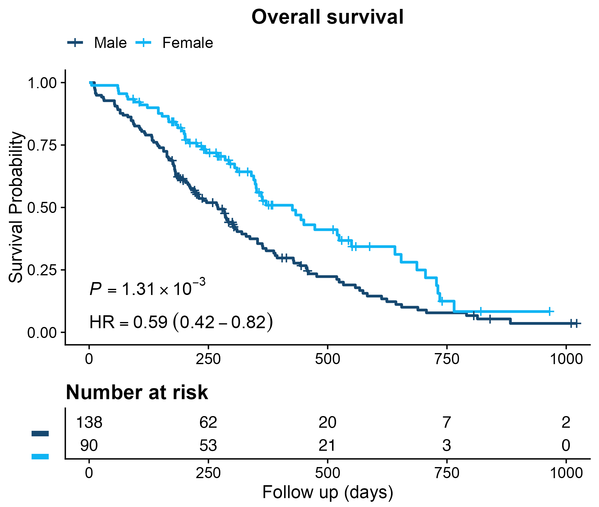
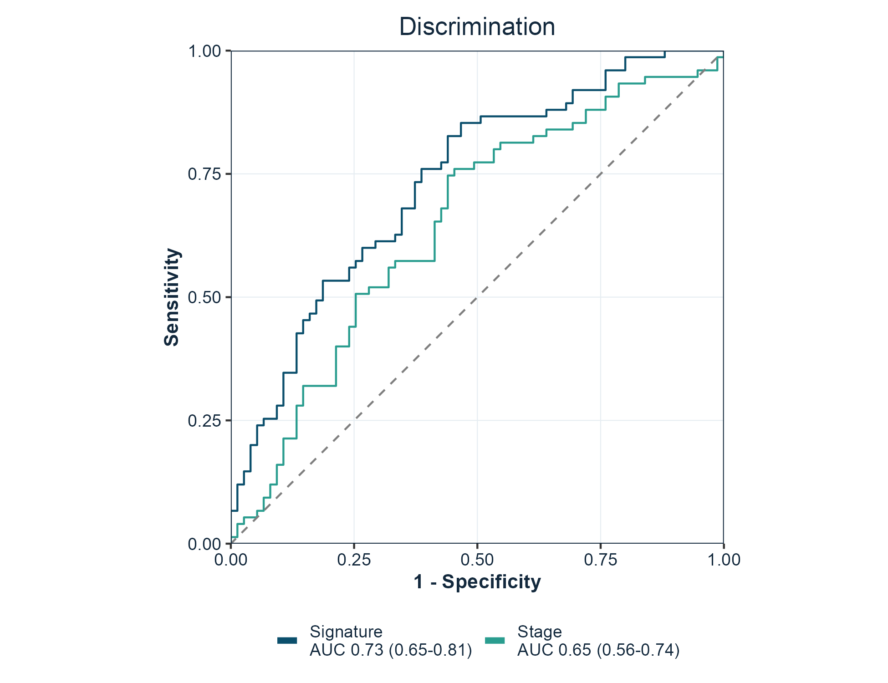

# gfplot

Publication-ready figures for cancer bioinformatics, in the style the
lab submits with. Kaplan-Meier curves with hazard ratios, ROC and
time-dependent ROC curves, risk-score distributions,
dimensionality-reduction projections, boxplots and correlation plots,
lasso coefficient paths, enrichment plots, and immune-infiltration radar
charts.

Every function returns a `ggplot` object, so figures stay editable with
the usual `ggplot2` grammar.

``` r

library(gfplot)

p <- plot_KMCurve(clin, labels)
gfplot_save(p, "figure1.png", width = 7, height = 5)
```

## Why gfplot exists

Two problems come up on every manuscript. Figures drift apart, because
each one is tuned by hand until nothing matches. And the code that
produced them lives in one-off scripts, so the next paper starts from
scratch.

`gfplot` fixes the second problem by making those figures functions, and
the first by being opinionated about presentation:

- **Arial on every figure.** The typeface journals ask for, set as the
  default on every function rather than applied per plot.
- **One baseline theme.** Loading the package sets the `ggplot2` theme
  to
  [`cowplot::theme_cowplot()`](https://wilkelab.org/cowplot/reference/theme_cowplot.html),
  so every figure in the session starts from the same look.
- **Journal palettes.**
  [`get_color()`](https://gflab.github.io/gfplot/reference/get_color.md)
  returns colour-blind-friendly palettes in the `nature`, `jco`,
  `lancet`, `jama`, and `jama_classic` styles.

This is a deliberate choice, not a side effect. Attaching `gfplot` is a
statement that this is the intended house style, and the package applies
it consistently. See [Figure style](#figure-style) to change any part of
it.

## Installation

``` r

# install.packages("remotes")
remotes::install_github("gflab/gfplot")
```

R 4.1 or later. The historical path `gaofeng21cn/gfplot` redirects here,
so older scripts keep working.

## Quick start

### Kaplan-Meier curves

Survival curves with the log-rank p-value, the hazard ratio from a
univariable Cox model, and a number-at-risk table.



Kaplan-Meier curve with risk table

``` r

library(gfplot)
library(survival)

data(lung)
keep <- complete.cases(lung[, c("time", "status", "sex")])

plot_KMCurve(
  Surv(lung$time[keep], lung$status[keep] == 2),
  factor(lung$sex[keep], labels = c("Male", "Female")),
  xlab = "Follow up (days)",
  title = "Overall survival"
)
```

### ROC curves

One curve per marker, with the area under the curve and its confidence
interval in the legend. `force05 = TRUE` flips markers that rank the
data backwards so every curve rises.



ROC curves for two markers

``` r

plot_ROC(
  cbind(Signature = signature_score, Stage = stage_score),
  labels,
  title = "Discrimination"
)
```

### Risk score distributions

Patients ordered by score, coloured by outcome, which is the standard
companion panel to a survival curve.


Risk score distribution

``` r

plot_RiskScore(risk_score, event, legend.position = c(0.15, 0.85))
```

## Functions

Every function returns a `ggplot` object.

| Area | Functions |
|----|----|
| Survival | [`plot_KMCurve()`](https://gflab.github.io/gfplot/reference/plot_KMCurve.md), [`generate_time_event()`](https://gflab.github.io/gfplot/reference/generate_time_event.md) |
| Discrimination | [`plot_ROC()`](https://gflab.github.io/gfplot/reference/plot_ROC.md), [`plot_TimeROC()`](https://gflab.github.io/gfplot/reference/plot_TimeROC.md), [`plot_MulROC()`](https://gflab.github.io/gfplot/reference/plot_MulROC.md) |
| Sample-level figures | [`plot_RiskScore()`](https://gflab.github.io/gfplot/reference/plot_RiskScore.md), [`plot_Boxplot()`](https://gflab.github.io/gfplot/reference/plot_Boxplot.md), [`plot_barplot()`](https://gflab.github.io/gfplot/reference/plot_barplot.md), [`plot_cor()`](https://gflab.github.io/gfplot/reference/plot_cor.md) |
| Projections and models | [`plot_PCA()`](https://gflab.github.io/gfplot/reference/plot_PCA.md), [`plot_UMAP()`](https://gflab.github.io/gfplot/reference/plot_UMAP.md), [`plot_lasso()`](https://gflab.github.io/gfplot/reference/plot_lasso.md) |
| Enrichment and immune figures | [`plot_GO()`](https://gflab.github.io/gfplot/reference/plot_GO.md), [`viewGSEA()`](https://gflab.github.io/gfplot/reference/viewGSEA.md), [`ggGSEA()`](https://gflab.github.io/gfplot/reference/ggGSEA.md), [`plot_immune()`](https://gflab.github.io/gfplot/reference/plot_immune.md) |
| Style and output | [`get_color()`](https://gflab.github.io/gfplot/reference/get_color.md), [`gfplot_save()`](https://gflab.github.io/gfplot/reference/gfplot_save.md), [`gfplot_font_setup()`](https://gflab.github.io/gfplot/reference/gfplot_font_setup.md) |

Notable arguments:

| Function | Argument | Purpose |
|----|----|----|
| [`plot_KMCurve()`](https://gflab.github.io/gfplot/reference/plot_KMCurve.md) | `risk.table` | Draw the number-at-risk table |
| [`plot_KMCurve()`](https://gflab.github.io/gfplot/reference/plot_KMCurve.md) | `limit` | Censor follow-up at a time point |
| [`plot_KMCurve()`](https://gflab.github.io/gfplot/reference/plot_KMCurve.md) | `annot` | Add your own annotation lines |
| [`plot_ROC()`](https://gflab.github.io/gfplot/reference/plot_ROC.md) | `force05` | Flip markers that rank backwards |
| [`plot_ROC()`](https://gflab.github.io/gfplot/reference/plot_ROC.md) | `percent.style` | Label axes as percentages |
| [`plot_UMAP()`](https://gflab.github.io/gfplot/reference/plot_UMAP.md), [`plot_PCA()`](https://gflab.github.io/gfplot/reference/plot_PCA.md) | `palette` | Choose the group colours |
| every plot | `font` | Override the typeface for one figure |

## Save a figure

[`gfplot_save()`](https://gflab.github.io/gfplot/reference/gfplot_save.md)
writes a file through a graphics device that can render the figure font,
chosen from the file extension. `.png`, `.tiff`, `.jpg`, and `.pdf` are
supported.

``` r

gfplot_save(p, "figure1.png", width = 7, height = 5, dpi = 300)
gfplot_save(p, "figure1.pdf", width = 7, height = 5)
```

Figures are drawn when they are printed, so a plot object is only turned
into a file by
[`gfplot_save()`](https://gflab.github.io/gfplot/reference/gfplot_save.md),
[`print()`](https://rdrr.io/r/base/print.html), or `ggsave()`.

## Fonts

Figures use Arial, which is what journals ask for. Most output needs no
preparation: the raster devices in [ragg](https://ragg.r-lib.org/) and
the `quartz` device on macOS resolve system fonts directly.

The base [`pdf()`](https://rdrr.io/r/grDevices/pdf.html) device keeps
its own font table and is the one route that needs help.
[`gfplot_font_setup()`](https://gflab.github.io/gfplot/reference/gfplot_font_setup.md)
reports the state of every route and registers Arial with
[`pdf()`](https://rdrr.io/r/grDevices/pdf.html) through
[extrafont](https://github.com/wch/extrafont) when it is installed:

``` r

gfplot_font_setup()
#> Figure font "Arial" can be rendered by:
#> • ragg raster devices (PNG, TIFF, JPEG): yes
#> • quartz (macOS PDF and screen): yes
#> • base pdf(): no
```

On macOS, `gfplot_save(p, "figure.pdf")` uses `quartz` and needs none of
this; the file embeds the real font. Every plotting function also takes
`font`, so a single figure can use a different family.

## Figure style

The house style is defined once, in three functions, so every figure in
a manuscript matches without per-figure tuning.

| Function | What it sets |
|----|----|
| [`gfplot_theme()`](https://gflab.github.io/gfplot/reference/gfplot_theme.md) | Type, grid, panel border, and legend placement |
| [`gfplot_colors()`](https://gflab.github.io/gfplot/reference/gfplot_colors.md) | Colours by role — `"model_curve"`, `"comparator_curve"`, `"reference_line"` |
| [`gfplot_legend()`](https://gflab.github.io/gfplot/reference/gfplot_legend.md) | Legend wrapping and when to hide it |

Colours are addressed by role rather than by hex value, so a figure
states what a colour is for:

``` r

gfplot_colors("primary")
#>   primary
#> "#0B4F6C"

gfplot_colors(c("model_curve", "comparator_curve"))
#>      model_curve comparator_curve
#>        "#0B4F6C"        "#2A9D8F"
```

Risk-group labels are matched by meaning, not spelling, so “Low Risk”,
“low-risk”, and “low risk” all take the model-curve colour.

Retune the whole suite for a session by overriding a role; no figure
code changes:

``` r

options(gfplot.palette = list(primary = "#123456"))
```

Each part can also be changed for a single figure:

``` r

# A larger base size for a figure that will be printed small
plot_KMCurve(clin, labels) + gfplot_theme(base_size = 14)

# One figure in a different typeface
plot_ROC(scores, labels, font = "Helvetica")

# One figure with a journal palette instead of the house ramp
plot_UMAP(embedding, groups, palette = "lancet")

# Keep an existing theme instead of adopting the baseline
options(gfplot.set_theme = FALSE)
library(gfplot)
```

## Optional back ends

Functions that build on specialised packages check for them at call time
and report what to install, so
[`library(gfplot)`](https://github.com/gflab/gfplot) always works.

| Function | Back end | Install |
|----|----|----|
| [`plot_KMCurve()`](https://gflab.github.io/gfplot/reference/plot_KMCurve.md) | survminer | `install.packages("survminer")` |
| [`plot_TimeROC()`](https://gflab.github.io/gfplot/reference/plot_TimeROC.md) | survivalROC | `install.packages("survivalROC")` |
| [`plot_UMAP()`](https://gflab.github.io/gfplot/reference/plot_UMAP.md) | umap | `install.packages("umap")` |
| [`plot_lasso()`](https://gflab.github.io/gfplot/reference/plot_lasso.md) | glmnet | `install.packages("glmnet")` |
| [`plot_immune()`](https://gflab.github.io/gfplot/reference/plot_immune.md) | ggradar | `remotes::install_github("ricardo-bion/ggradar")` |
| [`viewGSEA()`](https://gflab.github.io/gfplot/reference/viewGSEA.md), [`ggGSEA()`](https://gflab.github.io/gfplot/reference/ggGSEA.md) | DOSE, fgsea | `BiocManager::install(c("DOSE", "fgsea"))` |
| [`plot_barplot()`](https://gflab.github.io/gfplot/reference/plot_barplot.md) significance | ggpubr | `install.packages("ggpubr")` |
| [`gfplot_save()`](https://gflab.github.io/gfplot/reference/gfplot_save.md) raster output | ragg | `install.packages("ragg")` |

## Citation

``` r

citation("gfplot")
```

See `CITATION.cff` for machine-readable metadata. Both `v0.1.0` and
`v0.3.0` are tagged, so a specific state can be pinned.

## Provenance

`gfplot` was published first at `gaofeng21cn/gfplot` and later at
`gflab/gfplot`. The repository was deleted in August 2026. Other public
research code still installed it — `LidocaineQ/PIANOS` calls
`devtools::install_github("gflab/gfplot")` in its README and notebooks —
so those install commands became dead links.

The package was restored in September 2026 from a verified `git bundle`
of the full history. The recovered commit `89a60bdb` carries the
original `0.1.0` sources unchanged and is tagged `v0.1.0`; `v0.2.0` and
`v0.3.0` add the modernisation on top. The repository moved to the
`gflab` organisation, which is why the personal path redirects here and
both install commands resolve to the same commit.

Every exported function keeps its `0.1.0` name and arguments, so
existing calls continue to work without edits. If you are reading this
because an install failed in that window, the package is installable
again and no change to your code is required.

## Getting help

Bug reports and feature requests are welcome through [GitHub
Issues](https://github.com/gflab/gfplot/issues). Reference documentation
for every function is on the [package
site](https://gflab.github.io/gfplot/).

## License

Apache License 2.0. See
[LICENSE.md](https://gflab.github.io/gfplot/LICENSE.md). Copyright 2026
FengGao Lab contributors.

Versions before `0.4.1` were released under the MIT licence; those tags
keep the terms they were published with.
